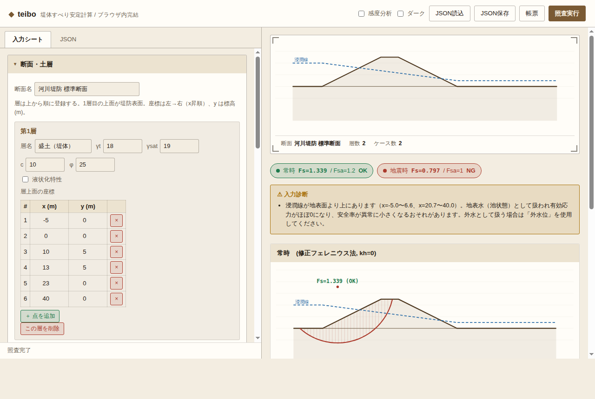

# teibo — 堤防の安定性照査ソフト

円弧すべり（分割法）によって堤防・盛土の**安定性を照査**するツールです。
綜合システム「堤体の安定計算」を参考に、中核となる円弧すべり安定計算を
Python（標準ライブラリのみ・外部依存なし）で実装しています。

**▶ ブラウザ版をすぐ試す**: <https://qua2psy10-web.github.io/claude-work-teibousoft/webui/>
（インストール不要・サーバ送信なし。入力〜照査〜帳票印刷までブラウザ内で完結します）



## 主な機能

- **円弧すべり安定計算**（分割法 / スライス法）
  - 修正フェレニウス法（震度法対応）
  - 簡易ビショップ法（反復計算・震度法対応）
  - 左右どちら向きのすべりも自動判別して評価
- **非円弧すべり面の照査（スペンサー法）**: 折れ線で与えた任意形状の
  すべり面に対し、層間力の傾角 θ を一定と仮定して力・モーメントの
  両平衡を満たす安全率 Fs を算定（軟弱層に沿う基盤すべり等に対応）
  - **臨界な非円弧すべり面の自動探索**（座標降下法＋複数シード）にも対応。
    円弧では見逃す基盤すべりを自動で発見できる
- **間隙水圧**の考慮（浸潤線を折れ線で入力、`u = γw·h`）
- **浸潤線の自動推定**（カサグランデの基本放物線による定常浸透の簡易解）
- **外水位**（河川水位）の考慮（地表面上の水重＋間隙水圧の水頭）
- **上載荷重**（天端の等分布荷重など、複数指定可）
- **テンションクラック**（亀裂によるすべり面の打ち切り＋亀裂内水圧）
- **常時／地震時／水位急降下時**の照査
  - 設計水平震度 `kh` による震度法
  - ケースごとに浸潤線・外水位を差し替え可能（水位急降下時の残留間隙水圧）
- **臨界すべり円の自動探索**（円中心の格子探索＋近傍細分化で最小安全率 Fs を探索）
  - 探索の拘束条件（始端・終端位置、すべり面下限標高）
- **液状化の考慮（FL 法）**: N 値・細粒分含有率から FL を算定し、
  過剰間隙水圧 Δu = ru·σv'（ru = FL⁻⁷）を安定計算へ反映
- **ニューマーク法**: 降伏震度 ky と滑動変位量 D を算定
  （経験式または加速度波形の時刻歴積分）、許容変位量 Da と比較
- **複数断面の一括処理**（`python -m teibo batch`）: 距離標ごとの断面を
  まとめて照査し、縦断方向の Fs 一覧（テキスト / CSV / 縦断グラフつき HTML）を出力
- **対策工の照査**: 押え盛土・地盤改良・ドレーン工（浸潤線低下）を
  適用した断面を自動生成し、無対策と Fs を比較
- **入力診断**: 浸潤線が地表面より上（池状態）、層順序の逆転、
  γsat < γt、強度ゼロ層などの誤入力を解析前に警告
- **ブラウザ GUI**（`python -m teibo gui`）: JSON 編集と同時に断面を
  プレビューし、その場で照査を実行してレポートを表示（入力診断の警告も表示）
- **感度分析**（c / φ / γ を変化させたときの Fs 一覧表）
- **多層地盤**（土層ごとに γt / γsat / c / φ を指定）
- **レポート出力**
  - コンソール向けテキスト
  - HTML レポート（SVG 断面図：地表面・土層・浸潤線・外水位・載荷重・
    臨界すべり円・テンションクラック・スライス・Fs 判定、感度分析表）

## 必要環境

- Python 3.9 以上（標準ライブラリのみ）
- テスト実行時のみ `pytest`

## 使い方

```bash
# 照査を実行（テキスト結果を標準出力）
python -m teibo analyze examples/river_levee.json

# HTML レポートも出力
python -m teibo analyze examples/river_levee.json --html report.html

# 拡張機能（載荷重・外水位・浸潤線自動推定・クラック・感度分析）のサンプル
python -m teibo analyze examples/levee_advanced.json --html report.html --sensitivity

# 地震時照査（液状化 FL 法・ニューマーク法）のサンプル
python -m teibo analyze examples/levee_seismic.json --html report.html

# 対策工の比較（押え盛土・地盤改良・ドレーン工）のサンプル
python -m teibo analyze examples/levee_countermeasure.json --html report.html

# ブラウザ GUI（http://127.0.0.1:8765/ で起動、入力ファイルは省略可）
python -m teibo gui examples/levee_advanced.json

# 複数断面の一括照査（縦断 Fs 一覧を CSV / HTML で出力）
python -m teibo batch examples/batch/levee_*.json --csv profile.csv --html profile.html --details
```

判定がすべて OK なら終了コード 0、いずれかが NG なら 1 を返します。
`--sensitivity` を付けると、入力の `sensitivity` 定義に基づく感度分析も実行します。

### 非円弧すべり面（スペンサー法）

軟弱層に沿う基盤すべりなど、円弧では表せないすべり面はスペンサー法で
照査できます。入力 JSON のトップレベル（またはケース）に折れ線の
すべり面 `slip_surface`（左→右）を与え、ケースの `method` を
`"spencer"` にします。始端・終端は地表面上、中間は地盤内に取ります。

```json
{
  "section": { "...": "..." },
  "slip_surface": [[9, 4.5], [13, -2.2], [21, -2.2], [24, 0]],
  "cases": [
    { "name": "常時",   "kh": 0.0,  "allowable_fs": 1.2, "method": "spencer" },
    { "name": "地震時", "kh": 0.15, "allowable_fs": 1.0, "method": "spencer" }
  ]
}
```

スペンサー法は層間力の傾角 θ を全スライスで一定と仮定し、力平衡
`ΣQ=0` を満たす Fs を各 θ で求めたうえで、モーメント平衡も満たす θ を
探索します（力・モーメント両平衡を満足）。円弧すべり面に適用すると
簡易ビショップ法とほぼ一致します。サンプル: `examples/levee_noncircular.json`。
ブラウザ単体版でも「解析法＝スペンサー(非円弧)」を選ぶと、シート上で
すべり面の折れ線を編集して照査できます。

**臨界な非円弧すべり面の自動探索**: `method="spencer"` のケースで
`slip_surface` を**省略する**と、臨界な非円弧すべり面を自動探索します。
円弧臨界円・軟弱層を初期形状（シード）として、等間隔ノードの標高と
入口/出口位置を座標降下法で最適化し、最小 Fs を与える凸なすべり面を
求めます。円弧すべりでは見逃しやすい軟弱層に沿う基盤すべりを自動で
検出できます。探索範囲は `grid` の `x_entry_min/max`・`x_exit_min/max`・
`y_lower_limit` で拘束でき、`nc_nodes`（既定 6）で中間ノード数を指定します。
サンプル: `examples/levee_base_slide.json`。ブラウザ単体版では「非円弧
すべり面」カードの「すべり面を自動探索する」で切り替えられます。

### 複数断面の一括処理（batch）

`python -m teibo batch 断面1.json 断面2.json ...` で距離標ごとの断面を
まとめて照査し、縦断方向の Fs 一覧を出力します。各入力 JSON の
トップレベルに `"station"`（距離標名。省略時はファイル名）と
`"distance"`（累積距離 m。全断面で指定するとソートと縦断グラフの
横軸に使用）を指定できます。`--csv` で表計算向け一覧、`--html` で
縦断グラフ（ケース別 Fs 折れ線＋必要安全率の破線）つきレポート、
`--details` で断面ごとの臨界円図も出力します。
終了コードは全断面 OK で 0、NG があれば 1。

### ブラウザ単体版（サーバ不要）

`webui/index.html` は計算エンジンを JavaScript に移植した**単体で動く版**で、
ファイルをブラウザで開くだけで入力シートから照査まで完結します
（Python もサーバも不要。社内配布やオフライン利用向け）。
入出力は CLI と同じ JSON 形式で相互に読み書きできます。

Python 版の全機能に対応: 円弧すべり計算・上載荷重・外水位・浸潤線自動推定・
テンションクラック・探索拘束・液状化(FL法)・ニューマーク法（滑動変位量）・
対策工の比較（押え盛土・地盤改良・ドレーン）・感度分析・入力診断。

さらに**帳票出力**に対応: 照査実行後に「帳票」ボタンで計算書
（土層条件・照査結果一覧・ケースごとの断面図とスライス計算表・
ニューマーク法・対策工比較・感度分析）を表示し、ブラウザの
印刷機能でそのまま PDF 保存できます。

**複数断面の一括処理**にも対応: ツールバーの「一括処理」ボタンから距離標ごとの
断面 JSON を複数選択すると、縦断方向の Fs 一覧表と縦断グラフ（ケース別の Fs 折れ線・
許容安全率の基準線・NG 箇所の強調）をまとめて表示します。距離（`distance`）が
全断面にあれば距離順に自動整列し、最小安全率とその位置、断面ごとの入力診断も併記。
結果は CSV 保存・PDF 印刷ができます（`python -m teibo batch` と同じ照査をブラウザ内で完結）。

### ブラウザ GUI

`python -m teibo gui` を実行してブラウザで `http://127.0.0.1:8765/` を開くと、
**入力シート（フォーム）** で JSON を書かずに入力できます:

- **断面・土層**: 層の追加/削除、層名・γt・γsat・c・φ・液状化特性（N値・FC）、
  層上面座標の表形式編集（行の追加/削除）
- **水条件**: 浸潤線（なし / カサグランデ自動推定 / 座標入力）、外水位
- **上載荷重・テンションクラック**
- **照査ケース**: ケース名・kh・Fsa・解析法・液状化考慮・ニューマーク・許容変位量
- **探索設定**: 分割数と拘束条件（空欄は自動設定）

編集するたびに右側の断面プレビューが更新され、入力診断の警告も即時表示
されます。「JSON」タブに切り替えると同じ内容を JSON として直接編集でき、
フォームと相互に同期します（対策工・感度分析・加速度波形などの高度な設定は
JSON タブで編集）。「照査実行」で臨界円探索を実行し、HTML レポートを
そのまま画面内に表示します。JSON の読込・保存も可能です。
外部依存はなく、標準ライブラリの HTTP サーバのみで動作します。

### 出力例

```
【照査結果】
------------------------------------------------------------
  ケース   : 常時
  解析法   : 修正フェレニウス法
  水平震度 : kh = 0.000
  必要安全率: Fsa = 1.20
  臨界円   : 中心(x=2.71, y=5.52), R=8.98 m
  最小安全率: Fs = 1.311
  判定     : Fs=1.311 >= Fsa=1.20  → ○ OK
```

## 入力ファイル形式（JSON）

```jsonc
{
  "section": {
    "name": "断面名",
    "layers": [
      {
        "name": "盛土（堤体）",
        "top":   [[-5,0],[0,0],[10,5],[13,5],[23,0],[40,0]], // 層上面折れ線(左→右)
        "gamma": 18.0,       // 湿潤単位体積重量 γt (kN/m3)
        "gamma_sat": 19.0,   // 飽和単位体積重量 γsat (kN/m3)
        "c": 10.0,           // 粘着力 c (kN/m2)
        "phi": 25.0          // 内部摩擦角 φ (度)
      },
      { "name": "基礎地盤", "top": [[-5,0],[40,0]], "gamma": 17, "gamma_sat": 18, "c": 15, "phi": 20 }
    ],
    "phreatic": [[-5,4],[0,4],[23,1],[40,1]],  // 浸潤線折れ線（省略可）
    "seepage": {                    // 浸潤線の自動推定（phreatic 省略時に有効）
      "water_level": 4.0,           //   外水位標高
      "waterside": "left",          //   川表（水がある側）: "left" / "right"
      "tail_level": 0.5             //   川裏側水位（省略時は川裏地盤高）
    },
    "external_water": [[-5,4],[8,4]],          // 外水位折れ線（省略可）
    "surcharges": [                            // 上載荷重（省略可・複数可）
      { "name": "天端載荷重", "x_start": 10, "x_end": 13, "q": 10.0 }
    ],
    "tension_crack": { "depth": 1.0, "water_depth": 0.5 }  // テンションクラック（省略可）
  },
  "cases": [
    { "name": "常時",   "kh": 0.0,  "allowable_fs": 1.2, "method": "fellenius" },
    {
      "name": "水位急降下時", "kh": 0.0, "allowable_fs": 1.2,
      "external_water": [],                     // 空リスト = 外水なし
      "phreatic": [[-5,4],[8,4],[23,1],[40,0.5]] // ケース専用の浸潤線（残留間隙水圧）
    },
    { "name": "地震時", "kh": 0.15, "allowable_fs": 1.0, "method": "fellenius" }
  ],
  "grid": {
    "n_slices": 40,        // 探索格子（省略時は断面から自動設定）
    "y_lower_limit": -3.0, // すべり面がこの標高より下に入る円を除外（省略可）
    "x_entry_min": 8.0     // すべり始端の許容範囲（x_entry_max / x_exit_min / x_exit_max も可）
  },
  "sensitivity": [         // 感度分析（--sensitivity 指定時に実行、省略可）
    { "layer": "盛土（堤体）", "param": "c", "values": [5, 10, 15] }
  ]
}
```

- **座標系**: x は右向き正、y は上向き正（標高）。単位は m。
- **土層**: `layers[0]` の上面が地表面（堤防表面）。以降の層を上から順に並べる。
  各層はその上面から次層上面まで（最下層は下方無限）を占める。
- **浸潤線より下**は `gamma_sat`、上は `gamma` を用いて重量を計算する。
- **seepage**: `phreatic` を省略した場合のみ有効。カサグランデの基本放物線で
  浸潤線を自動推定する（下記「計算式」参照）。
- **external_water**: 地表面より上の水は水柱重量としてスライスに加算し、
  間隙水圧の水頭には浸潤線と外水位の高い方を採用する。
- **surcharges**: 鉛直等分布荷重。スライス重量に `q×重なり幅` を加算する
  （震度 `kh` の慣性力にも寄与）。
- **tension_crack**: すべり面の頭部側で被り厚が `depth` に達した位置で
  すべり面を打ち切り、`water_depth` の水による亀裂内水圧を起動側に加える。
- **cases[].phreatic / cases[].external_water**: ケース単位で水条件を差し替える。
  キー省略で断面の設定を継承、`external_water: []` で「外水なし」。
- **method**: `"fellenius"`（修正フェレニウス法）または `"bishop"`（簡易ビショップ法）。
- **grid** の各項目（`xc_min/xc_max/yc_min/yc_max/nx/ny/tangent_y_min/tangent_y_max/nr/n_slices`）
  を省略すると、断面形状から妥当な探索範囲を自動設定する。
  `y_lower_limit` / `x_entry_min` / `x_entry_max` / `x_exit_min` / `x_exit_max` で
  探索するすべり円を拘束できる。
- **sensitivity**: `param` は `c` / `phi` / `gamma` / `gamma_sat`。指定した層の
  値を差し替えて臨界円探索を再実行し、Fs の一覧表を出力する。
- **液状化（layers[].liquefaction / cases[].consider_liquefaction）**:
  砂質土層に `"liquefaction": {"n_value": 12, "fines_content": 15}` を与え、
  ケース側で `"consider_liquefaction": true` とすると、飽和域のすべり面で
  FL 法による過剰間隙水圧を加算する（`kh > 0` のケースのみ有効）。
- **ニューマーク法（cases[].newmark）**: `"newmark": true` のケースについて
  臨界円の降伏震度 ky と滑動変位量 D を算定し、
  `"allowable_displacement"`（m, 既定 0.5）と比較する。トップレベルの
  `"accel_series": [[時刻 s, 加速度 gal], ...]` を与えると時刻歴積分、
  なければ経験式（Ambraseys & Menu, 1988）で推定する。
- **対策工（countermeasures）**: 各「案」は次の効果を任意に組み合わせられる。
  案ごとに断面を生成して全ケースを再照査し、無対策と比較する。

  ```jsonc
  "countermeasures": [
    {
      "name": "案1: 押え盛土",
      "berm": {           // 盛土後の表面形状。既存地表面より高い部分が盛土になる
        "top": [[21,1],[23,2],[28,2],[32,0]],
        "gamma": 18, "gamma_sat": 19, "c": 5, "phi": 30
      },
      "improvement": {    // 地盤改良（矩形範囲の c・φ を差し替え。improvements で複数指定も可）
        "x_start": 17, "x_end": 27, "y_top": 1, "y_bottom": -3, "c": 100, "phi": 0
      },
      "phreatic": [[...]] // ドレーン工などによる浸潤線の低下
    }
  ]
  ```

  改良範囲は液状化判定の対象外となる（液状化対策を表現）。
  単位体積重量は元の土層のまま（せん断強度のみ差し替え）。
- **入力診断**: 解析前に自動実行され、警告はレポート冒頭と標準エラー出力に
  表示される（解析は続行する）。検出項目: 浸潤線が地表面より上（池状態、
  外水位で水没している範囲は除く）、層上面の逆転、γsat < γt、c=φ=0 の層、
  範囲外の載荷重、未使用の液状化特性など。

## 計算式

分割法によるすべり円の安全率（設計水平震度 `kh`、間隙水圧 `u`）：

**修正フェレニウス法**

```
      Σ [ c·l + (W·cosα − kh·W·sinα − u·l)·tanφ ]
Fs = ---------------------------------------------
            Σ [ W·sinα + kh·W·cosα ]
```

**簡易ビショップ法**（`Fs` について反復）

```
      Σ [ (c·b + (W − u·b)·tanφ) / mα ]                    tanα·tanφ
Fs = ----------------------------------- ,  mα = cosα ( 1 + --------- )
        Σ [ W·sinα + kh·W·cosα ]                                Fs
```

ここで各スライスについて
`W`: 重量（土＋上載荷重＋地表面上の外水）、`α`: 基面傾角、`l`: 基面長、
`b`: スライス幅、`c`,`φ`: すべり面の土質定数、
`u`: 間隙水圧（`u = γw·(水頭標高 − すべり面標高)`、水頭は浸潤線と外水位の高い方）。
Σ W sinα が負となる円は −x 方向のすべりとして α を反転（鏡像）して評価する。

**テンションクラック**（深さ `zc`、水深 `zw`）

すべり面頭部側で被り厚が `zc` に達した位置ですべり面を打ち切り、
亀裂内水圧の合力 `Pw = ½·γw·zw²`（水平）による円中心まわりの
モーメントを半径 `R` で除した等価起動力を分母に加える。

**浸潤線の自動推定**（カサグランデの基本放物線）

川表法面と外水位の交点 A から水側へ `0.3Δ`（Δ: 法面水没部の水平投影長)
の点 A0 を通過点とし、川裏法尻 F を焦点とする基本放物線

```
y² = y0² + 2·y0·ξ ,   y0 = √(d² + h²) − d
```

（`ξ`: F からの水平距離、`d`,`h`: F から見た A0 の水平距離・高さ）で
浸潤線を生成する。地表面・外水位を超えないようにクランプし、
川裏側は裏水位に接続する。定常浸透の簡易近似であり、
厳密な浸透流解析（FEM 等）の代替ではない。

**液状化判定（FL 法、道路橋示方書の簡略版）**

```
N1 = 170·N/(σv'+70),  Na = c1·N1 + c2（c1,c2: FC による補正）
RL = 0.0882·√(Na/1.7)（Na≥14 では +1.6e-6·(Na−14)^4.5）,  R = RL（cw=1.0）
L  = rd·kh·σv/σv',  rd = 1 − 0.015z,  FL = R/L
ru = 1 (FL≤1) / FL⁻⁷ (FL>1)   → Δu = ru·σv' を静水圧に加算
```

**ニューマーク法**

臨界すべり円について `Fs(kh) = 1` となる降伏震度 ky を二分法で求め、
滑動変位量 D を次のいずれかで算定する:

- 経験式（Ambraseys & Menu, 1988 平均値):
  `log10 D[cm] = 0.90 + log10[(1−ky/kmax)^2.53 · (ky/kmax)^−1.09]`
- 加速度波形（`accel_series`）の時刻歴積分（降伏加速度 ay=ky·g を超える
  区間の剛体ブロック片側すべり）

ky = 0（震度によらず Fs ≤ 1）の場合は剛体ブロック法の適用外として
変位量は算定しない（流動的破壊のおそれ）。

## テスト

```bash
pip install pytest
python -m pytest tests/
```

幾何計算の内挿・交点、安全率の手計算一致、震度・間隙水圧・粘着力に対する
挙動、臨界円探索の統合動作に加え、上載荷重・外水位・ケース別水条件・
テンションクラック・探索拘束・感度分析・浸潤線自動推定の各機能を検証します。

## パッケージ構成

```
teibo/
  model.py         データモデル（断面・土層・浸潤線・載荷重・クラック・照査ケース・探索格子）
  geometry.py      折れ線内挿・円と地表面の交点・鉛直スライスの土層積分・間隙水圧・外水
  stability.py     スライス生成・クラック処理・液状化反映・フェレニウス/ビショップ安全率
  spencer.py       スペンサー法（非円弧すべり面・力/モーメント両平衡）
  ncsearch.py      非円弧すべり面の自動探索（座標降下法＋複数シード）
  search.py        臨界すべり円の格子探索＋近傍細分化・拘束条件・OK/NG 判定
  seepage.py       浸潤線の自動推定（カサグランデの基本放物線）
  liquefaction.py  液状化判定（FL 法）と過剰間隙水圧
  newmark.py       降伏震度とニューマーク法による滑動変位量
  countermeasure.py 対策工（押え盛土・地盤改良・ドレーン）の適用と再照査
  batch.py         複数断面の一括照査（縦断 Fs 一覧・CSV・縦断グラフ）
  diagnostics.py   入力診断（誤入力の警告）
  sensitivity.py   感度分析
  io_json.py       JSON 入力の読み込み
  report.py        テキスト / HTML(SVG) レポート
  webapp.py        ブラウザ GUI（標準ライブラリの HTTP サーバ）
  cli.py           コマンドライン
examples/river_levee.json          河川堤防のサンプル断面（基本）
examples/levee_advanced.json       拡張機能を使ったサンプル断面
examples/levee_seismic.json        地震時照査（液状化・ニューマーク法）のサンプル
examples/levee_countermeasure.json 対策工比較のサンプル
examples/levee_noncircular.json    非円弧すべり面（スペンサー法・指定面）のサンプル
examples/levee_base_slide.json     非円弧すべり面の自動探索（基盤すべり）のサンプル
tests/                             テスト一式
```

## 制限事項

円弧すべり（フェレニウス／ビショップ）と非円弧すべり（スペンサー法）に
対応し、いずれも臨界すべり面の自動探索が可能です。次の機能は含みません
（将来拡張の想定）:

- 非円弧すべり面の自動探索は、円弧臨界円・軟弱層をシードとした
  局所最適化（座標降下法）であり、大域最適の保証はない。凸性・最小規模・
  層間力傾角の妥当域といった制約で退化解を抑えているため、複雑な
  多層断面では初期形状（シード）や探索範囲の調整が必要な場合がある
- 厳密な浸透流解析（浸潤線はカサグランデの基本放物線による簡易推定、
  または入力値として与える）
- 対策工の**自動設計**（対策工は入力として与えた案の照査・比較のみ。
  必要な盛土形状・改良範囲を自動決定する機能はない）

また、液状化判定（cw=1.0 固定の簡略式）とニューマーク法（剛体ブロック・
片側すべり）は簡易実装であり、詳細検討には各基準に基づく解析が必要です。

## 免責

本ソフトウェアは技術計算の補助を目的としています。実務での設計・照査に
用いる場合は、各基準・指針に基づき結果を必ず技術者が検証してください。

## ライセンス

MIT License（詳細は [LICENSE](LICENSE) を参照）。
